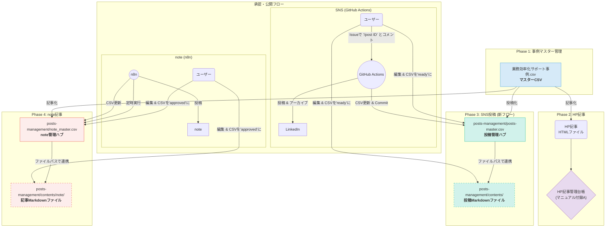
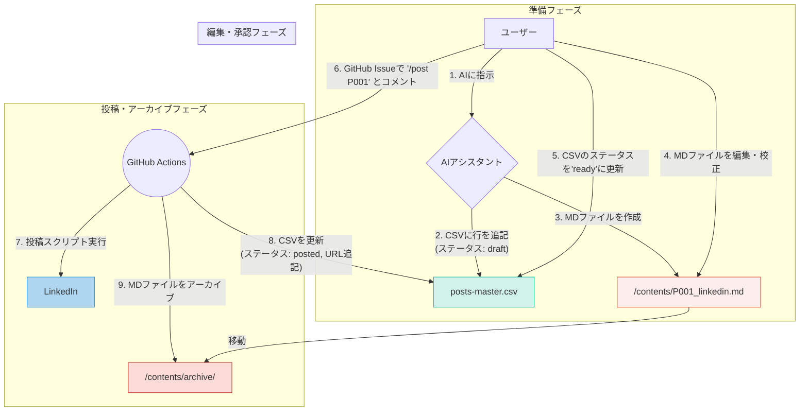

# コンテンツ作成ワークフロー公式マニュアル

## 概要
このドキュメントは、株式会社デジタルツール研究所におけるすべてのコンテンツ（事例データ、ウェブサイト記事、SNS投稿、note記事）を作成・管理するための**唯一の公式な手順書**です。

このフローは、**1つのマスターデータを源泉（Source of Truth）**とし、そこから各メディアのコンテンツを生成し、それぞれの専用管理ファイルで進行状況を管理する**ハイブリッド型システム**を採用しています。これにより、一貫性を保ちながら、各コンテンツの特性に合わせた柔軟な管理を実現します。

## 全体アーキテクチャ


---

## Phase 1: 事例データの作成と同期

このフェーズでは、ウェブサイト記事の元となる「AI活用事例」のデータを**マスターファイルに**蓄積し、そこから業界別・職種別のファイルへ自動的に同期します。

### データ管理の原則
- **原本 (Source of Truth)**: すべての事例データの原本は、プロジェクトルートにある `業務効率化サポート事例 - 活用サポート事例.csv` です。**データの追加・修正は必ずこのファイルに対してのみ行います。**
- **配布用ファイル**: `article-workspace/case_studies_data/` 内にある業界別・職種別ファイルは、マスターファイルから自動生成された「写し」です。これらを直接編集することはありません。
- **デュアル構造**: 生成されるファイルは、意図的に2種類の粒度で管理されています。
    - `【業界別】/*.csv`: 各業界の文脈で事例を理解するため、**元の詳細な職種名（例: 工場長, 看護師長）がそのまま保持**されます。
    - `【職種別】/*.csv`: 職種という切り口で広く事例を分析するため、`industry-job-simple-list.md` に基づき、**正規化された職種カテゴリー（例: 経営・管理職）に統一**されます。
- **同期**: マスターファイルの更新後、`scripts/sync_case_study_csvs.py` を実行することで、すべての配布用ファイルがこのルールに沿って最新の状態に保たれます。

```mermaid
graph TD
    A[マスターCSV<br>業務効率化サポート事例.csv] --> B{同期スクリプト実行<br>scripts/sync_case_study_csvs.py};
    B --> C[【業界別】フォルダ];
    B --> D[【職種別】フォルダ];
    C --> E[製造業.csv<br>(職種: 工場長, ...)];
    C --> F[飲食業.csv<br>(職種: 店長, ...)];
    D --> G[経営・管理職.csv<br>(工場長, 店長, 社長...を統合)];
    D --> H[事務・バックオフィス.csv<br>(事務員, 経理担当...を統合)];
```

### 手順1: 事例の作成 (AI)
1.  **指示出し**:
    ユーザーがAIアシスタントに対し、以下のように指示します。
    > **指示例**:
    > 「製造業 × 経営者の事例データを1つ、マスターCSVに追加してください。テーマは在庫管理の効率化で。」

2.  **AIアシスタントの処理 (データ追加)**:
    - AIはマスターファイル `業務効率化サポート事例 - 活用サポート事例.csv` に、以下の品質ガイドラインを厳守して新しい事例データを追記します。
    - マスターファイル内の既存データと重複しないように、最新の `No.` を確認し、連番で新しいIDを割り振ります。
    - `HP記事化` 列は「未着手」と設定します。

<details>
<summary>【重要】事例作成の品質ガイドライン</summary>

AIアシスタントは、以下のガイドラインに従って、高品質で現実的な中小企業向けの事例を作成します。

#### 基本方針
- **ターゲット**: 地方・中小企業（従業員数50名以下が中心）
- **技術レベル**: GAS, Cursor, LLM活用による簡易ツール開発など、低コスト・短期間・簡単操作で実現できるもの。
- **表現**: 「AI需要予測」のような大げさな表現は避け、「GAS売上集計+ChatGPT改善提案」のように、具体的で現実的な技術表現を用いる。

#### 各項目の作成基準
- **事例タイトル (30-50文字)**:
  - 数値改善型: 「○○が△△%改善」「○○時間→○○分に短縮」
  - 課題解決型: 「○○の悩みをゼロに」「○○から卒業」
- **業務内容 (10-20文字)**: 職種が担当する具体的な業務を記述。
- **支援前の課題 (50-100文字)**: 具体的な数値（時間、コスト、エラー率等）を含む、実際に発生しうる課題。
- **AI活用方法 (50-100文字)**: 実現可能なAI技術・具体的な導入手順。
- **業務効率化の効果 (50-100文字)**: ビフォー・アフターが明確な具体的な数値改善。
- **まとめ (30-80文字)**: 効果の総括と今後の展望。
- **その他**:
  - `HP記事化`は「未着手」と設定。
  - `作成日`は処理を実行する本日の日付を `YYYY-MM-DD` 形式で設定。

#### 数値設定の指針
- **時間短縮**: 20-95% 削減
- **品質・満足度向上**: 10-30% 向上
- **効率・生産性向上**: 20-50% 向上
- **コスト削減**: 10-50% 削減
</details>

### 手順2: 事例データの同期 (AI)
1.  **指示出し**: ユーザーがAIアシスタントに同期を指示します。
    > **指示例**: 「事例データを同期してください。」
2.  **AIアシスタントの処理**: `scripts/sync_case_study_csvs.py` を実行し、業界別・職種別ファイルを最新の状態に更新します。
    - **【初回実行時】**: `pandas`ライブラリがない場合などは、AIが仮想環境の作成とライブラリのインストールを案内し、問題を解決します。

---

## Phase 2: ウェブサイト用記事の作成

このフェーズでは、Phase 1で作成した事例データをもとに、ウェブサイトに掲載するためのHTML記事を作成し、公開可能な状態にします。**エラーを防ぐため、以下の手順を厳密に遵守します。**

### 担当者
AIアシスタント

### 手順
ユーザーがAIアシスタントに対し、**マスターCSVファイル**内の特定の事例を指定して指示します。
> **指示例**:
> 「マスターCSVのNo.125の事例で、ウェブサイト用の記事を1本作成してください。」

AIアシスタントは指示を受けると、以下の3ステップの処理を自動的に実行します。

---

### Step 1: カード情報の登録【最重要】

- **操作ファイル:** `public_html/data/case-studies.json`
- **AIの処理内容:**
    1. このJSONファイルを開き、既存のデータ形式に倣って、新しい記事の情報を**オブジェクトとして末尾に追記**します。
    2. 以下の項目をすべて設定します。
        - `id`: `case-026` のように、既存の最大番号+1のIDをつけます。
        - `title`: 記事の正式タイトル。
        - `summary`: 一覧ページに表示される短い要約文（約80～120文字）。
        - `industry`: 業種カテゴリー（例: "飲食業"）。
        - `date`: **公開日** (`YYYY-MM-DD`形式)。この日付順に一覧ページは並びます。
        - `tags`: 関連キーワードを配列で5つ指定します (例: `["AI活用", "コスト削減"]`)。
        - `thumbnail`: サムネイル画像のパス (例: `images/case-studies/case-026.jpg`)。
        - `url`: **記事のURL** (例: `blog/new-article.html`)。SEOを意識した分かりやすい名前にします。
    - **【注意】** AIは、JSON内の各オブジェクト（記事データ）の`id`が、必ず**連番**になるよう処理します。`case-024`のような欠番があると、一覧ページでリンクが正しく生成されないエラーの原因となるためです。

### Step 2: 記事ファイルの作成

- **配置場所:** `public_html/blog/` ディレクトリ
- **AIの処理内容:**
    1. `Step 1`で決めた`url`と同じ名前で、新しいHTMLファイルを作成します (例: `new-article.html`)。
    2. 既存の事例記事を参考に、記事のヘッダー情報（タイトル、公開日、タグ）と本文を記述します。
    3. **【最重要】パスの修正:**
        - 新しい記事は `/blog/` ディレクトリ内に作成されるため、AIは**パスの修正を必須作業**として実行します。
        - CSS、JavaScript、画像、ページ内リンクなど、すべての相対パスの先頭に `../` を自動的に追加します。
        - **修正例:**
            - **誤:** `<link rel="stylesheet" href="css/style.css">`
            - **正:** `<link rel="stylesheet" href="../css/style.css">`
        - この修正を怠ると、新しい記事のレイアウトが崩れ、画像が表示されなくなります。

### Step 3: マスターCSVの更新

- **操作ファイル:** `業務効率化サポート事例 - 活用サポート事例.csv`
- **AIの処理内容:**
    1. このファイルを開き、該当する事例の `HP記事化` 列を「作成済み」に更新します。
    2. 同時に、`記事URL` 列に、作成した記事のURLを追記します。

---

## Phase 3: SNS投稿の作成と管理 (コンテンツ分離・GitHub Actions自動化)
このフェーズでは、マスター事例を元にSNS投稿を作成し、**コンテンツ(Markdown)と管理情報(CSV)を分離**して管理します。投稿は**ユーザーからの指示をトリガーに、GitHub Actionsが投稿・更新・アーカイブまでを完全自動で実行**します。編集のしやすさと確実な実行を両立した、現在の標準ワークフローです。

### アーキテクチャ


### 手順1: 投稿コンテンツの生成 (AI)
1.  **指示出し (ユーザー)**:
    > **指示例**:
    > 「マスターCSVのNo.125の事例を元に、LinkedIn用の投稿を1つ作成してください。」

2.  **AIの処理 (ドラフト作成)**:
    AIは指示を受けると、以下の2つのファイルを同時に作成・更新します。
    - **① 管理CSVの更新:**
        - **ファイル:** `posts-management/posts-master.csv`
        - **処理:** 新しい投稿ID（例: `P002`）で新しい行を追記します。`ステータス`は`draft`、`コンテンツファイル`には対応するMarkdownファイル名（例: `P002_linkedin.md`）を記録します。
    - **② コンテンツファイルの作成:**
        - **ファイル:** `posts-management/contents/`
        - **処理:** 上記で決めたファイル名（`P002_linkedin.md`）で、プラットフォームに最適化された投稿本文を持つMarkdownファイルを作成します。

### 手順2: 校正と承認 (ユーザー)
1.  **本文の編集:**
    ユーザーは `posts-management/contents/` にある、`ステータス`が`draft`のMarkdownファイル（`P002_linkedin.md`など）を開き、投稿内容を自由に編集・校正します。**ファイル全体がそのまま投稿される**ため、見出しなどは不要です。
2.  **投稿の承認:**
    編集が完了したら、`posts-management/posts-master.csv` を開き、該当する投稿IDの`ステータス`列を `draft` から `ready` に変更します。**この変更がGitHubへの投稿許可の合図となります。**

### 手順3: 自動投稿とアーカイブ (ユーザー & GitHub Actions)
1.  **投稿指示 (ユーザー)**:
    ユーザーは好きなタイミングで、GitHubリポジトリの**Issues**を開き、**任意のIssueで新しいコメント**として以下のように入力します。
    > **投稿コマンド**:
    > `/post P002`
    > *( `/post` と `投稿ID` の間には半角スペースが必要です)*
2.  **全自動処理 (GitHub Actions)**:
    コメントを検知したGitHub Actionsが、以下の処理をすべて自動で行います。
    - **a. 投稿:** `P002` のコンテンツファイルを読み込み、LinkedInに投稿します。
    - **b. CSV更新:** `posts-master.csv` の該当行のステータスを `posted` に更新し、実際の投稿URLを追記します。
    - **c. アーカイブ:** 投稿済みのコンテンツファイル (`P002_linkedin.md`) を `posts-management/contents/archive/` ディレクトリに移動させます。
    - **d. コミット:** 更新されたCSVと、アーカイブされたファイルの移動結果を、自動でリポジトリにコミット＆プッシュします。

### 手順4: マスターCSVの更新 (AI)
- SNS投稿が作成された時点で、AIは `業務効率化サポート事例 - 活用サポート事例.csv` の該当事例の `SNS投稿化` 列を「作成済み」に更新します。

---

## Phase 4: note記事の作成と管理 (ファイル分離方式)
このフェーズでは、複数のマスター事例を組み合わせて、特定のテーマに沿ったnote記事を作成します。**長文の編集性を考慮し、管理台帳(CSV)と記事本文(Markdown)を分離して管理します。**

### ワークフロー
1.  **指示出し (ユーザー)**:
    > **指示例**:
    > 「小売業の事例 (No. 5, 16) を使って、『【小売業のDX】明日から使えるAI活用事例』というタイトルのnote記事を作成してください。」

2.  **記事コンテンツの生成 (AI)**:
    - **操作ファイル1(本文):** `posts-management/contents/note/`
    - **操作ファイル2(台帳):** `posts-management/note_master.csv`
    - AIは指示された複数の事例を元に、note用の長文記事を作成し、`posts-management/contents/note/` ディレクトリ内に **Markdownファイル (`N001.md`など) として保存します。**
    - 同時に `note_master.csv` に新しい行を追記し、記事のメタデータと、今作成したMarkdownファイルへのパスを **`Content_File_Path` 列に記録**します。
    - `Status`列は`draft`として設定します。

3.  **校正と承認 (ユーザー)**:
    - ユーザーは `note_master.csv` で `Status` が `draft` の行を探します。
    - `Content_File_Path` 列に記載されたパスを元に、対応するMarkdownファイルをテキストエディタで開き、**快適に長文を編集・校正します。**
    - 編集完了後、`note_master.csv` に戻り、該当行の `Status`列を`approved`に変更し、`Publish_Date`に投稿したい日時 (`YYYY-MM-DD HH:MM`) を設定します。

4.  **自動投稿と実績記録 (n8n)**:
    - n8nのワークフローが `note_master.csv` を定期的に巡回します。
    - `Status`が`approved`の行を見つけると、`Content_File_Path` からMarkdownファイルを読み込み、その内容をnoteに自動投稿（または下書き保存）します。
    - 投稿後、n8nは `note_master.csv` の該当行の`Status`を`published`に変更し、`Note_URL`列に実際の記事URLを記録します。

5.  **マスターCSVの更新 (AI)**:
    - note記事が作成された時点で、AIは `業務効率化サポート事例 - 活用サポート事例.csv` の該当事例の `note記事化` 列を「作成済み」に更新します。（複数の事例を使っている場合はすべて更新）

---

## 付録A: HP記事管理台帳
ウェブサイトに公開済みの記事コンテンツの一覧です。**この台帳はHP記事の管理にのみ使用します。**

| ID | 記事タイトル | 公開ステータス | URL | 画像準備 | 公開日 | タグ | メモ |
| --- | --- | --- | --- | --- | --- | --- | --- |
| 1 | メニュー・会計管理システムのランニングコストをゼロに！簡易開発によって複数店舗の立ち上げを実現 | 公開済み | blog/restaurant-order-system-cost-reduction.html | OK | 2025-06-01 | 飲食業, 簡易開発, コスト削減, 多店舗運営, 業務効率化 | JSONと同期済み |
| 2 | 味ブレ・ミスを防ぐ。店舗間レシピ標準化で新人も即戦力に | 公開済み | blog/restaurant-recipe-standardization.html | OK | 2025-06-02 | 飲食業, 業務標準化, 品質管理, 人材育成, 多店舗運営 | JSONと同期済み |
| 3 | SNS更新が週5本ペースに。投稿作成の手間を劇的削減した店舗の仕組み化 | 公開済み | blog/salon-sns-automation.html | OK | 2025-06-03 | 美容・サロン業, 集客・マーケティング, AI活用, 業務効率化, 業務自動化 | JSONと同期済み |
| 4 | 毎月のイベントで集客向上。年間販促を"考える負担ゼロ"で回る仕組み化の力 | 公開済み | blog/restaurant-promotion-automation.html | OK | 2025-06-04 | 飲食業, 集客・マーケティング, 業務自動化, 売上向上, 業務効率化 | JSONと同期済み |
| 5 | 効率的な在庫管理でロス削減と売上向上を両立。データ活用で実現した小売業の最適化 | 公開済み | blog/retail-inventory-optimization.html | OK | 2025-06-05 | 小売業, 在庫最適化, データ活用, コスト削減, 売上向上 | JSONと同期済み |
| 6 | 再来率UPと手間削減を同時に。LINE自動ステップ配信で実現した店舗の変化 | 公開済み | blog/service-line-step-delivery.html | OK | 2025-06-06 | 飲食業, 集客・マーケティング, 業務自動化, 顧客満足度向上, 売上向上 | JSONと同期済み |
| 7 | シフト調整が迷わずスムーズに。調理・フロアも一元管理で現場ストレスを軽減 | 公開済み | blog/restaurant-shift-management.html | OK | 2025-06-07 | 飲食業, 業務効率化, 業務自動化, 多店舗運営, DX推進 | JSONと同期済み |
| 8 | 口コミ数7倍＆評価向上。仕組み化で信頼を集めた店舗の信頼 | 公開済み | blog/service-review-improvement.html | OK | 2025-06-08 | 飲食業, 顧客満足度向上, 集客・マーケティング, 業務標準化, 品質管理 | JSONと同期済み |
| 9 | 求人原稿の作成時間を半減。魅力が伝わる募集文で応募数アップを実現 | 公開済み | blog/recruitment-ai-copywriting.html | OK | 2025-06-09 | サービス業, AI活用, 人材育成, 業務効率化, DX推進 | JSONと同期済み |
| 10 | 新人育成の不安をゼロに。接客・業務マニュアルの仕組み化で現場が変わった日 | 公開済み | blog/service-manual-systematization.html | OK | 2025-06-10 | サービス業, 人材育成, 業務標準化, 業務効率化, 品質管理 | JSONと同期済み |
| 11 | 日報作成が1/4の時間に。事務作業を仕組み化し現場の余裕を生んだ工夫 | 公開済み | blog/service-daily-report-automation.html | OK | 2025-06-11 | サービス業, 業務効率化, 業務自動化, DX推進, 生産性向上 | JSONと同期済み |
| 12 | 廃棄コストを25%削減。毎日の在庫確認を仕組み化した現場の挑戦 | 公開済み | blog/restaurant-waste-cost-reduction.html | OK | 2025-06-12 | 飲食業, 在庫最適化, コスト削減, 業務効率化, データ活用 | JSONと同期済み |
| 13 | 繁忙期の応援調整がたった3分で。欠員対応のストレスを解消した仕組み化 | 公開済み | blog/restaurant-staff-support-system.html | OK | 2025-06-13 | 飲食業, 業務効率化, 多店舗運営, 人材育成, DX推進 | JSONと同期済み |
| 14 | 飲食店がAI研修をきっかけにバンドル提案強化、接客フレーズもAI活用でスムーズな販売促進を実現 ～課題だった客単価8％向上～ | 公開済み | blog/restaurant-ai-training-upsell.html | OK | 2025-06-14 | 飲食業, AI活用, 売上向上, 人材育成, 顧客満足度向上 | JSONと同期済み |
| 15 | クレーム対応の不安ゼロへ。AI提案で統一感ある返信が信頼を生んだ事例 | 公開済み | blog/service-complaint-handling-ai.html | OK | 2025-06-15 | サービス業, AI活用, 顧客満足度向上, 業務標準化, 品質管理 | JSONと同期済み |
| 16 | 店頭販促が統一感アップ＆作成時間75%削減。POP・チラシの自動化が現場を変えた | 公開済み | blog/retail-pop-automation.html | OK | 2025-06-16 | 小売業, 業務自動化, 集客・マーケティング, 業務効率化, 業務標準化 | JSONと同期済み |
| 17 | リピート率15％→50％に回復！AI研修で"記憶に頼る接客"から卒業 | 公開済み | blog/beauty-salon-ai-training.html | OK | 2025-06-17 | サービス業, AI活用, 顧客満足度向上, 人材育成, 売上向上 | JSONと同期済み |
| 18 | 近隣イベントを逃さず価格調整。小規模ホテルが"スマートに"高収益化を実現 | 公開済み | blog/hotel-dynamic-pricing.html | OK | 2025-06-18 | サービス業, データ活用, 売上向上, 業務自動化, DX推進 | JSONと同期済み |
| 19 | 説明のバラつきをゼロに。"接客の型"をAIで仕組み化した宿泊施設の挑戦 | 公開済み | blog/hotel-service-standardization.html | OK | 2025-06-19 | サービス業, AI活用, 業務標準化, 顧客満足度向上, 品質管理 | JSONと同期済み |
| 20 | 顧客特性分析で受注率30％向上。AI活用により営業が"見える化"された事例 | 公開済み | blog/sales-customer-analysis-ai.html | OK | 2025-06-20 | サービス業, AI活用, データ活用, 売上向上, 営業効率化 | JSONと同期済み |
| 21 | AI解析で離職率25％減。人材管理に"予測"が加わった組織変革事例 | 公開済み | blog/hr-turnover-prediction-ai.html | OK | 2025-06-21 | サービス業, AI活用, 人材育成, データ活用, 組織運営 | JSONと同期済み |
| 22 | 手作業5時間→15分に短縮。AI自動集計で経営判断が"リアルタイム"になった事例 | 公開済み | blog/management-data-aggregation-ai.html | OK | 2025-06-22 | サービス業, AI活用, 業務自動化, データ活用, 業務効率化 | JSONと同期済み |
| 23 | 在庫コスト40％削減。AI需要予測で"勘と経験"から卒業した製造業の変革 | 公開済み | blog/manufacturing-demand-forecasting-ai.html | OK | 2025-06-23 | 製造業, AI活用, 在庫最適化, コスト削減, データ活用 | JSONと同期済み |
| 24 | 従業員の提案数3倍増。AI活用で"アイデアが出ない"文化を変えた組織改革 | 公開済み | blog/internal-idea-generation-ai.html | OK | 2025-06-25 | サービス業, AI活用, 組織運営, 人材育成, DX推進 | JSONと同期済み |
| | | | | | | | |

## 付録B: SNS投稿管理CSV (`posts-management/sns_master.csv`) 列定義
| 列名 | 説明 | AI担当 | ユーザー担当 | システム担当 |
|---|---|---|---|---|
| `Post_ID` | SNS投稿のユニークID (例: S001) | **設定** | | |
| `Source_No` | 元にしたマスターCSVの`No.` | **設定** | | |
| `Platform` | 投稿先 (例: LinkedIn, Facebook) | **設定** | | |
| `Content` | 投稿文の全文 | **作成 (draft)** | **校正・承認** | |
| `Status` | 状態 (`draft`, `approved`, `published`, `cancelled`) | `draft`に設定 | `approved`に変更 | `published`に変更 |
| `Post_URL` | 公開後の投稿URL | | | **記録** |

## 付録C: note記事管理CSV (`posts-management/note_master.csv`) 列定義
| 列名 | 説明 | AI担当 | ユーザー担当 | n8n担当 |
|---|---|---|---|---|
| `Note_ID` | note記事のユニークID (例: N001) | **設定** | | |
| `Source_Nos` | 元にしたマスターCSVの`No.` (カンマ区切り) | **設定** | | |
| `Title` | 記事のタイトル | **作成** | **校正・承認** | |
| `Content_File_Path` | 記事本文(Markdown)へのパス | **作成** | | |
| `Status` | 状態 (`draft`, `approved`, `published`, `cancelled`) | `draft`に設定 | `approved`に変更 | `published`に変更 |
| `Publish_Date` | 公開予約日時 (`YYYY-MM-DD HH:MM`) | | **設定** | |
| `Note_URL` | 公開後の記事URL | | | **記録** | 