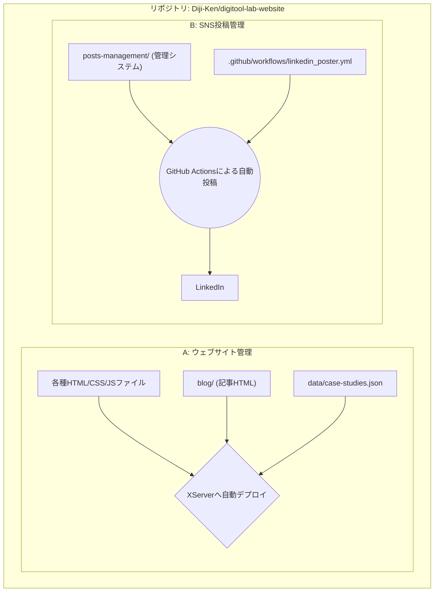
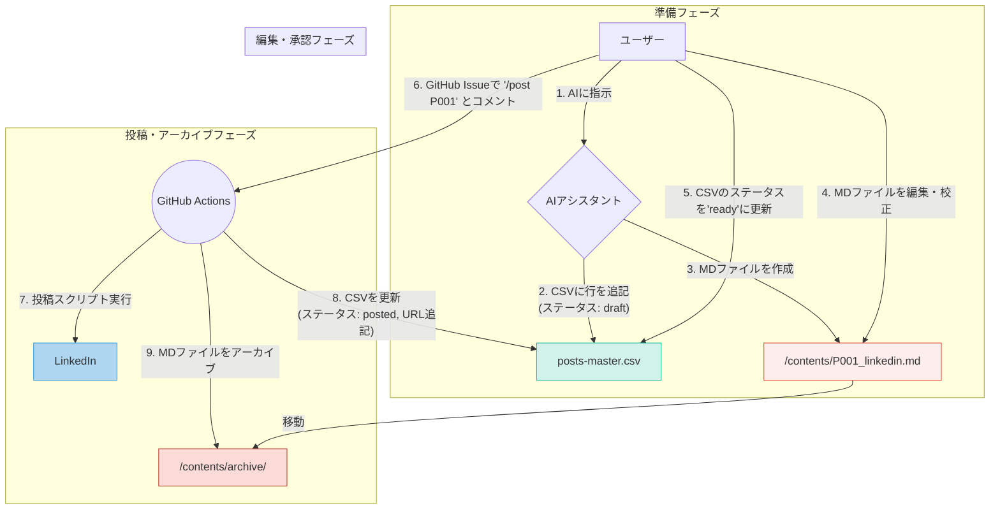

# コンテンツ作成・管理 統合ワークフロー

## 1. 概要
このドキュメントは、株式会社デジタルツール研究所における**ウェブサイトの更新**と**SNSの投稿管理**の2つの業務を、単一のリポジトリで一元的に管理するための**公式な手順書**です。

## 2. 全体アーキテクチャ
このリポジトリは、ウェブサイト公開用のファイル群と、SNS投稿を自動化するための管理システムが共存しています。

---

## 3. ウェブサイトの更新フロー
（このセクションは、既存の `README.md` の内容をベースにしています）

### Step 1: カード情報の登録
- **操作ファイル:** `data/case-studies.json`
- **作業内容:** 新しい記事の情報を、このJSONファイルに追記します。`id`は必ず連番にしてください。

### Step 2: 記事ファイルの作成
- **配置場所:** `blog/` ディレクトリ
- **作業内容:** 新しいHTML記事ファイルを作成します。既存の記事を複製する場合、CSSや画像へのパスがずれるため、パスの先頭に`../`を追加する修正が必須です。

### Step 3: Gitへのプッシュ
- `git add .`, `git commit`, `git push` を行い、変更をリポジトリに反映します。
- プッシュ後、GitHub Actionsが自動で本番環境（XServer）にファイルをデプロイします。

---

## 4. SNS投稿の自動化フロー (コンテンツ分離方式)
編集のしやすさと確実な実行を両立した、現在の標準ワークフローです。

> **開発者向け注記:**
>
> 投稿スクリプトをローカル環境で直接実行・デバッグする際の手順については、
> [`posts-management/README.md`](./posts-management/README.md) を参照してください。

### アーキテクチャ

### 手順1: 投稿コンテンツの生成 (AI)
1.  **指示出し (ユーザー)**:
    > **指示例**:
    > 「マスターCSVのNo.125の事例を元に、LinkedIn用の投稿を1つ作成してください。」

2.  **AIの処理 (ドラフト作成)**:
    - **① 管理CSVの更新:** `posts-management/posts-master.csv` に新しい投稿IDで行を追記し、ステータスを `draft` とします。
    - **② コンテンツファイルの作成:** `posts-management/contents/` に、対応するMarkdownファイルを作成します。

### 手順2: 校正と承認 (ユーザー)
1.  **本文の編集:** `posts-management/contents/` にあるMarkdownファイルを編集します。
2.  **投稿の承認:** `posts-management/posts-master.csv` を開き、該当行のステータスを `ready` に変更します。

### 手順3: 自動投稿とアーカイブ (ユーザー & GitHub Actions)
1.  **投稿指示 (ユーザー)**: GitHubリポジトリの**Issues**で、新しいコメントとして以下のように入力します。
    > `/post P001`
2.  **全自動処理 (GitHub Actions)**:
    - **a. 投稿:** LinkedInに投稿します。
    - **b. CSV更新:** ステータスを `posted` に更新し、URLを追記します。
    - **c. アーカイブ:** 使用したMarkdownファイルを `archive` ディレクトリに移動します。
    - **d. コミット:** すべての変更をリポジトリに自動でコミット＆プッシュします。 